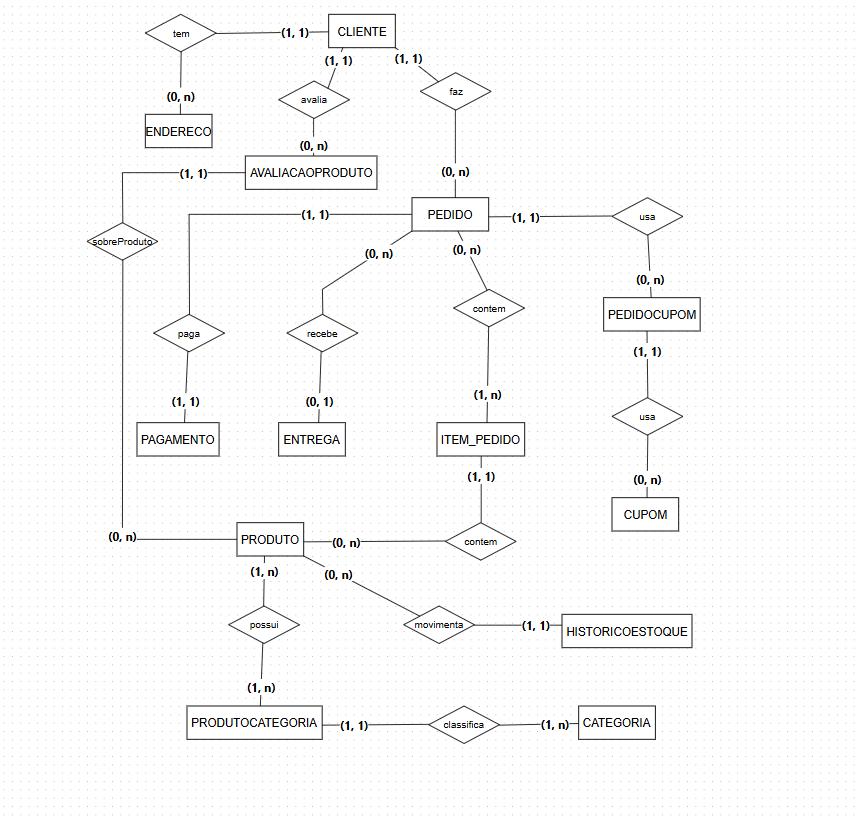

# 🛒 Projeto: Banco de Dados E-commerce

**Descrição:**  
Projeto acadêmico de Banco de Dados Relacional para um sistema de e-commerce. Inclui modelagem **conceitual, lógica e física**, além de **scripts SQL** para criação, inserção, consulta e manutenção de dados.

---

## 🛠️ Ferramentas Utilizadas
- **VS Code** — edição de scripts SQL e organização do projeto  
- **pgAdmin** — gerenciamento do banco de dados PostgreSQL  
- **DBDiagram** — visualização do modelo lógico a partir do arquivo DBML  
- **BRModelo** — criação do modelo conceitual (diagrama ER)  

---

## 📌 Objetivos / Funcionalidades
- Gerenciamento de **clientes, produtos e pedidos**  
- Controle de **estoque e histórico de pedidos**  
- Aplicação de **cupons de desconto**  
- Garantir **integridade referencial** e consistência dos dados  
- Separação de scripts DML por tipo: `INSERT`, `UPDATE`, `DELETE` e `SELECT`  

---

## 📂 Estrutura do Projeto

**Modelagem**  
- `modelagem_conceitual.png` → Diagrama conceitual  
- `modelagem_lógica.png` → Diagrama lógico  
- `modelagem_lógica.dbml` → Arquivo DBML usado no DBDiagram  

**Scripts SQL**  
- `modelagem_física.sql` → Criação das tabelas (DDL)  
- `inserts.sql` → Inserção de dados  
- `consultas.sql` → SELECT  
- `atualizacoes.sql` → UPDATE  
- `exclusoes.sql` → DELETE  

---

## ⚙️ Pré-requisitos
- Banco de dados compatível com SQL (MySQL, PostgreSQL, etc.)  
- DBDiagram ou outra ferramenta que suporte arquivos DBML  

---

## 🖥️ Usando o DBML
1. Acesse [DBDiagram](https://dbdiagram.io/)  
2. Clique em **New Diagram**  
3. Importe `modelagem/modelagem_lógica.dbml`  
4. Visualize o **diagrama lógico** gerado automaticamente  

---

## 🚀 Executando os Scripts SQL
1. Crie o banco de dados no seu SGBD  
2. Execute `modelagem_física.sql` para criar as tabelas  
3. Execute `inserts.sql` para popular o banco  
4. Teste operações com `consultas.sql`, `atualizacoes.sql` e `exclusoes.sql`  

---

## 📸 Diagrama Conceitual

---

## 📝 Observações Técnicas
- Scripts testados para garantir integridade referencial  
- Nomes de tabelas e colunas padronizados e consistentes  
- Modelagem organizada para fácil manutenção e escalabilidade  

---

## 🔗 Referências
- [DBDiagram](https://dbdiagram.io/)  
- [BRModelo](https://brmodelo.com.br/)  
- [pgAdmin](https://www.pgadmin.org/)  
- [VS Code](https://code.visualstudio.com/)
